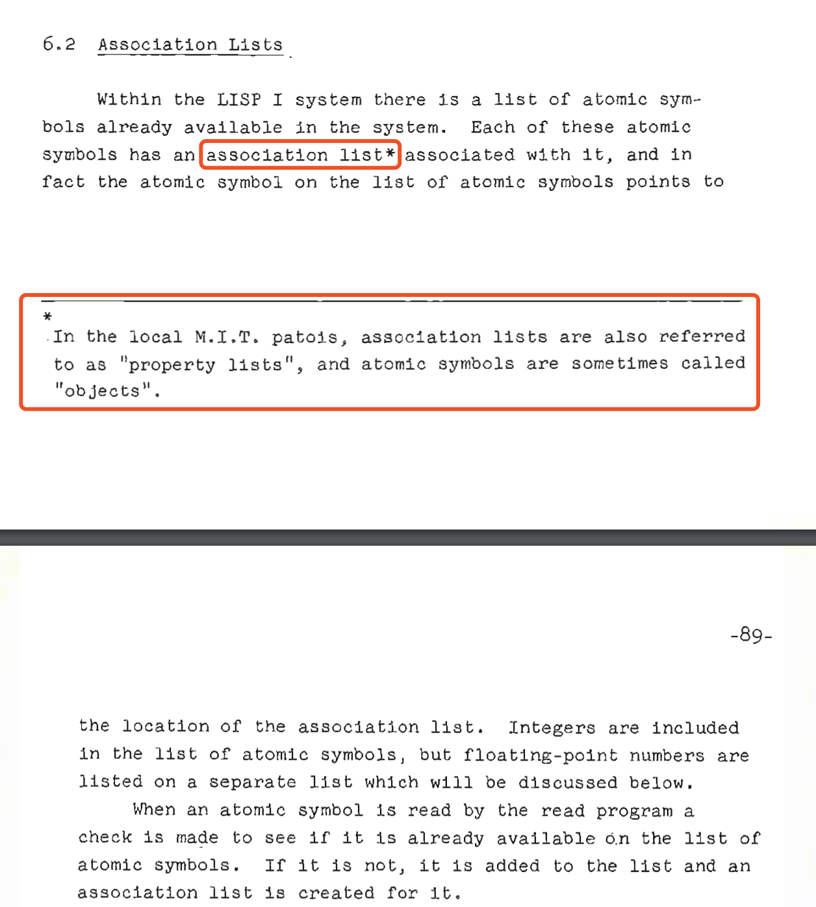
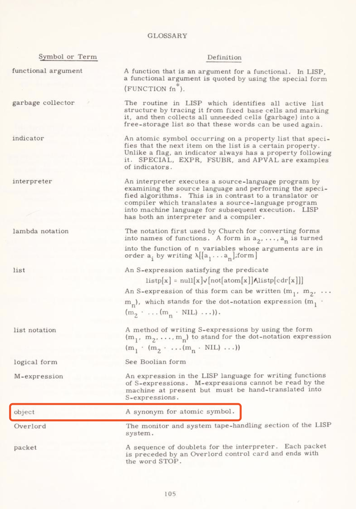
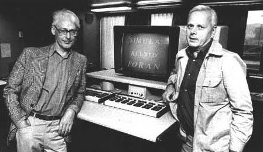
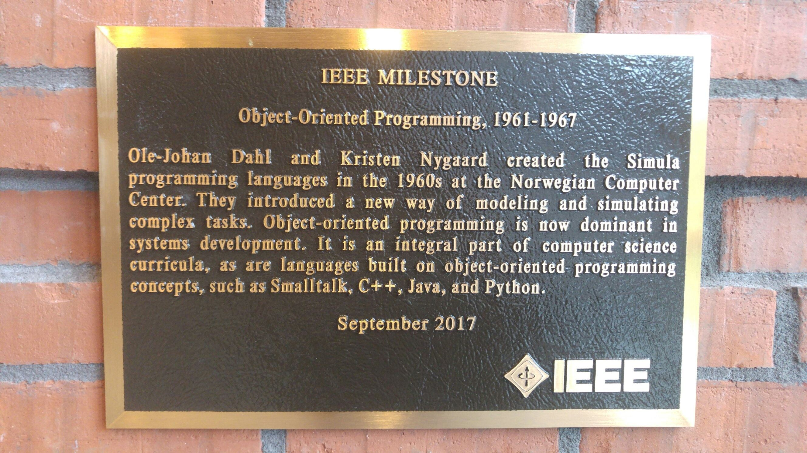
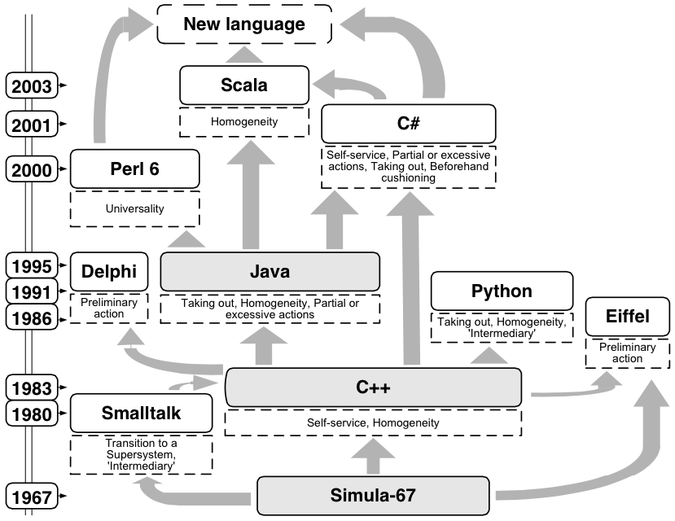

# OOP - 历史的巨轮

```sh
 ___ 🚩__
/___P___/O......
O      O......#THE GREAT WHEEL OF HISTORY oops...
```

## 前言

`JavaScript 是基于对象，不是面向对象` -- 前不久听到的一句话，据说流传还挺广的。（其实是来自 `winter` 老师[前端训练营](https://u.geekbang.org/lesson/12?article=215673)的一个小作业）

那么`基于`和`面向`又是什么鬼？基于就不是面向了？

本着求知好学的科学探索精神，我们深入挖掘下`面向对象`到底是个什么东西。

_PS: 英文不好的同学请自备翻译器，本文不保证翻译以及个人理解的准确性，英文好的大佬们可以指正下文中的错误，文中翻译来自 [DeepL](https://www.deepl.com/translator)_

## 历史

根据某[靠谱百科](https://en.wikipedia.org/wiki/Object-oriented_programming#History)，我们可以追溯下 OOP 的历史。

- `1950s-1960s`，`对象` 和 `面向` 首次出现在 `MIT`
- `1958`，John McCarthy 在 MIT 开发 LISP
- `1960`，LISP 1 的手册中提到 `objects`[[10]](###[10])
- `1962`，LISP 1.5 的手册中定义了 `object`[[11]](###[11])
- `1962`，Ole-Johan Dahl 和 Kristen Nygaard 开发 [Simula](###Simula)
- `1966`，Sumila 引入 `类和子类`
- `1966`，Alan Kay 受 Sketchpad、Simula 等影响， 想到 OOP 架构，之后对 LISP 的深入理解，影响了他的架构思考[[12]](###[12])
- `1967`，Simula 在会议上介绍 `Class and Subclass Declarations`，Simula 67 被认为是第一个面向对象的语言
- `1967`，Alan Kay 被问在干嘛，回答到 `object-oriented programming`，OOP 这个词首次出现
- `1972`，Alan Kay 等人开发 `Smalltalk`，之后影响了 Lisp 引入 OOP
- `1986`，计算机械协会组织了第一届面向对象的程序设计、系统、语言和应用会议(OOPSLA)，出乎意料的是，有 1000 人参加了会议
- `1980s`，曾在 ITT 公司使用 Smalltalk 的 Brad Cox 和在博士论文中使用 Simula 的 Bjarne Stroustrup 开发了 Objective-C，最终去创建了面向对象的 C++
- `90 年代初中期`，当支持面向对象编程技术的编程语言被广泛使用时，面向对象编程发展成为主流的编程范式。由于图形化用户界面的日益普及，其主导地位得到了进一步的加强，而图形化用户界面在很大程度上依赖于面向对象的编程技术。

> 援引 "对象 "和 "面向对象 "的术语在现代意义上的 "面向对象编程 "在 20 世纪 50 年代末 60 年代初在麻省理工学院首次出现。在人工智能小组的环境中，早在 1960 年，"对象 "就可以指具有属性（属性）的可识别项（LISP 原子）；[10][11]Alan Kay 后来在 1966 年引用对 LISP 内部的详细理解对他的思想产生了很大的影响。

> Terminology invoking "objects" and "oriented" in the modern sense of object-oriented programming made its first appearance at MIT in the late 1950s and early 1960s. In the environment of the artificial intelligence group, as early as 1960, "object" could refer to identified items (LISP atoms) with properties (attributes);[10][11] Alan Kay was later to cite a detailed understanding of LISP internals as a strong influence on his thinking in 1966.[12]

### [10]

[LISP 1 手册](http://history.siam.org/sup/Fox_1960_LISP.pdf)中，第 88 页，提到了 `atomic synbols` 在 MIT 有时候被叫做 `objects`

> 在当地的 M.I.T.乡语中，[原子符号的关联列表也被称为 "属性列表"，原子符号有时被称为 "对象"

> In the local M.I.T. patois, association lists [of atomic symbols] are also referred to as "property lists", and atomic symbols are sometimes called "objects"



### [11]

[LISP 1.5 手册](https://archive.org/details/lisp15programmer00john/page/105) 中，第 105 页，出现了 `object` 定义

> object - 原子符号的代名词

> object — a synonym for atomic symbol



### [12]

Alan Kay 对 OOP 的说明，来自 Alan Kay 和 Stefan Ram 关于 OOP 的邮件讨论  
[Dr. Alan Kay on the Meaning of “Object-Oriented Programming”](./mail.md)

#### OOP 的两个权威来源

- 国际标准组织在 [ISO/IEC 2382-15:2015](https://www.iso.org/obp/ui/#iso:std:iso-iec:2382:ed-1:v1:en) 中的定义，截止到目前 `2020` 一共有 3 个版本，`ISO/IEC 2382-15:1985` | `ISO/IEC 2382-15:1999` | `ISO/IEC 2382-15:2015`，85 和 99 已经失效了，最新是的 2015 版
- Alan Kay，国标说他创造了这个词，他在邮件中回复确认了

#### Alan Kay & OOP

- 66 年 11 月，想到 OOP 架构
- 67 年被问，回答是 OOP
- OOP 对 Alan Kay 来说只意味着消息传递、本地保留和保护和隐藏状态过程，以及极端晚期绑定所有的东西

### Simula

- `1962`，Ole-Johan Dahl 和 Kristen Nygaard 开始开发[Simula](https://en.wikipedia.org/wiki/Simula)
- `1966`，引入了 `类和子类`
- `1967`，介绍论文 `Class and Subclass Declarations`

> Simula 67 介绍了对象、类、继承和子类、虚拟过程、coroutines 和离散事件模拟，并介绍了垃圾回收的特点。

> Simula 67 introduced objects, classes, inheritance and subclasses, virtual procedures, coroutines, and discrete event simulation,and features garbage collection.

> Simula 67 被认为是第一种面向对象的编程语言。

> Simula 67 is considered the first object-oriented programming language.

> 1966 年，Dahl 和 Nygaard 写了一个 Simula 编译器。他们开始致力于将 Tony Hoare 的记录类概念付诸实践，这个概念已经在自由形式的、类似英文的通用仿真语言 SIMSCRIPT 中实现。他们选择了一个具有记录类属性的通用化过程概念，以及第二层前缀。通过前缀，一个过程可以引用它的前级，并具有额外的属性。Simula 因此引入了类和子类的层次结构，以及从这些类中生成对象的可能性。

> In 1966, Dahl and Nygaard wrote a Simula compiler. They became preoccupied with putting into practice Tony Hoare's record class concept, which had been implemented in the free-form, English-like general-purpose simulation language SIMSCRIPT. They settled for a generalised process concept with record class properties, and a second layer of prefixes. Through prefixing a process could reference its predecessor and have additional properties. Simula thus introduced the class and subclass hierarchy, and the possibility of generating objects from these classes.

> Simula 1 编译器和新版的程序设计语言 Simula 67 是通过 1967 年的会议上的研究论文 "类和子类声明 "向更广泛的世界介绍的。

> The Simula 1 compiler and a new version of the programming language, Simula 67, was introduced to the wider world through the research paper "Class and Subclass Declarations" at a 1967 conference.







## 后续

> OOP to me means only messaging, local retention and protection and hiding of state-process, and extreme late-binding of all things. It can be done in Smalltalk and in LISP. There are possibly other systems in which this is possible, but I'm not aware of them.

看完历史，我们发现 Alan Kay 眼中的 OOP 如上所说，那么关于 JavaScript 和 OOP 之间的关系呢，害，精力有限下次再说 oops...

_未完待续..._
